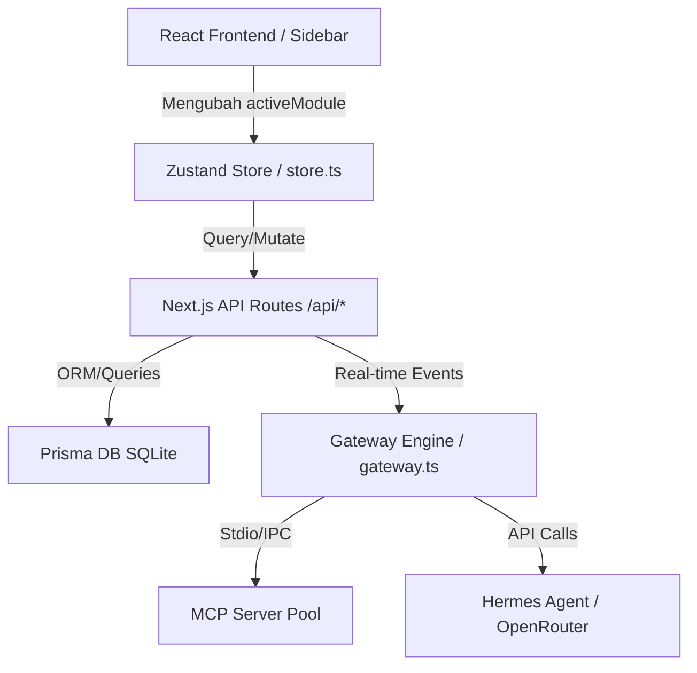

# 🎼 GangNiaga AI OS — Senibina & Reka Bentuk Sistem
> **Kategori:** Core Architecture & State Management

GangNiaga AI OS menggunakan seni bina berpandukan **Multi-Agent Orchestration Layer** yang diuruskan secara berpusat melalui Zustand State Store tempatan dan diselaraskan ke backend Next.js API Routes.

---

## 🏗️ 1. Rangka Kerja Seni Bina (System Overview)

Berikut adalah diagram aliran data yang menunjukkan interaksi komponen GangNiaga:



### A. Komponen Utama Sistem
1. **Frontend Client (React/Next.js):** Antarmuka responsif yang menyokong standard PWA, dioptimumkan menggunakan Framer Motion dan Tailwind CSS.
2. **State Store (Zustand - `src/lib/store.ts`):** Menguruskan keadaan global aplikasi termasuk perbualan copilot, senarai ejen yang sedang berjalan (`running`), tugasan aktif, status saluran OpenClaw, dan parameter sidebar.
3. **Gateway Engine (`src/lib/gateway.ts`):** Rantai penghubung utama yang memproses konfigurasi personaliti ejen (`Soul`), memantau log, mendepositkan memori, dan mengesahkan rujukan sumber data.
4. **Integration Layer (MCP & AI Providers):** Menghubungkan ejen dengan peranti luaran (seperti CLI shell, sistem fail, pangkalan data) dan model AI (Hermes, OpenRouter, Claude, GPT).

---

## 🔄 2. Kitaran Hayat Sesi Ejen (Agent Session Lifecycle)

Setiap ejen beroperasi secara autonomi menerusi kitaran hidup lima fasa:

```
  ┌─────────┐     ┌─────────┐     ┌──────────┐     ┌───────────┐
  │  IDLE   │────▶│ RUNNING │────▶│ COMPLETED│
  └────┬────┘     └────┬────┘     └──────────┘
       │               │
       │               │
       │          ┌────┴────┐
       │          │  ERROR  │
       │          └────┬────┘
       │               │
       └───────────────┘
```

1. **IDLE (Sedia):** Ejen sedia untuk diaktifkan dan dikonfigurasikan.
2. **RUNNING (Beroperasi):** Ejen sedang memproses tugasan, menulis cadangan, atau memanggil alat luar.
3. **COMPLETED (Selesai):** Semua tugasan dalam senarai telah diselesaikan dengan output tersimpan di pangkalan data.
4. **ERROR (Gagal):** Kegagalan tidak dapat dipulihkan berlaku (timeout, API error). Ejen akan cuba melakukan restart automatik sekiranya `autoRestart` ditetapkan kepada `true`.

---

## ⚡ 3. Pengurusan Keadaan Global (Zustand State Store)

Store utama di `src/lib/store.ts` dibahagikan kepada sub-state yang mengawal aliran aplikasi secara berpusat:

```typescript
export interface AppState {
  // Routing & Sidebar
  activeModule: ModuleId;
  setActiveModule: (module: ModuleId) => void;
  sidebarCollapsed: boolean;
  toggleSidebar: () => void;
  
  // AI Chat & Copilot
  chatMessages: ChatMessage[];
  addChatMessage: (msg: ChatMessage) => void;
  chatLoading: boolean;
  
  // Fleet Management (Agents, Tasks)
  agents: AgentInfo[];
  setAgents: (agents: AgentInfo[]) => void;
  tasks: TaskInfo[];
  addTask: (task: TaskInfo) => void;
  
  // Database Synchronization
  syncState: 'synced' | 'syncing' | 'error';
  triggerSync: () => Promise<void>;
}
```

### Amalan Terbaik Pembangunan:
- **State Selection:** Elakkan memanggil keseluruhan store di komponen kecil bagi mengelakkan rendering semula yang tidak perlu. Sentiasa gunakan selector:
  ```typescript
  const activeModule = useAppStore((state) => state.activeModule);
  ```
- **Optimistic Updates:** Frontend akan mengemas kini state dengan serta-merta semasa operasi CRUD (seperti menambah tugasan ejen) sementara menunggu respons API backend selesai.
